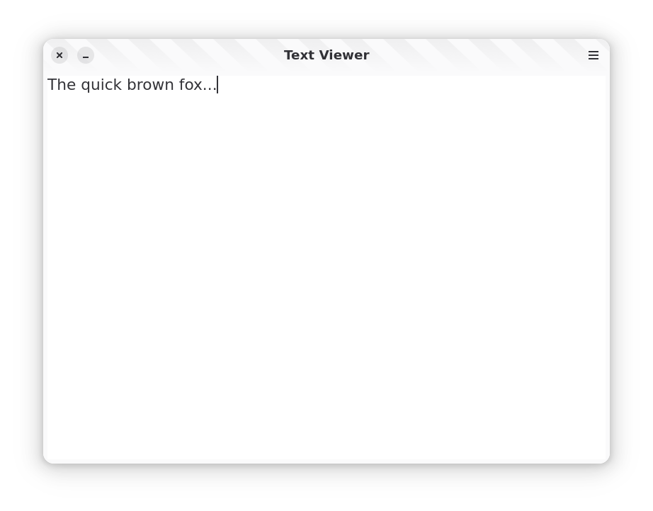
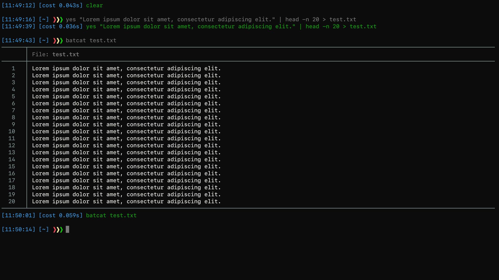
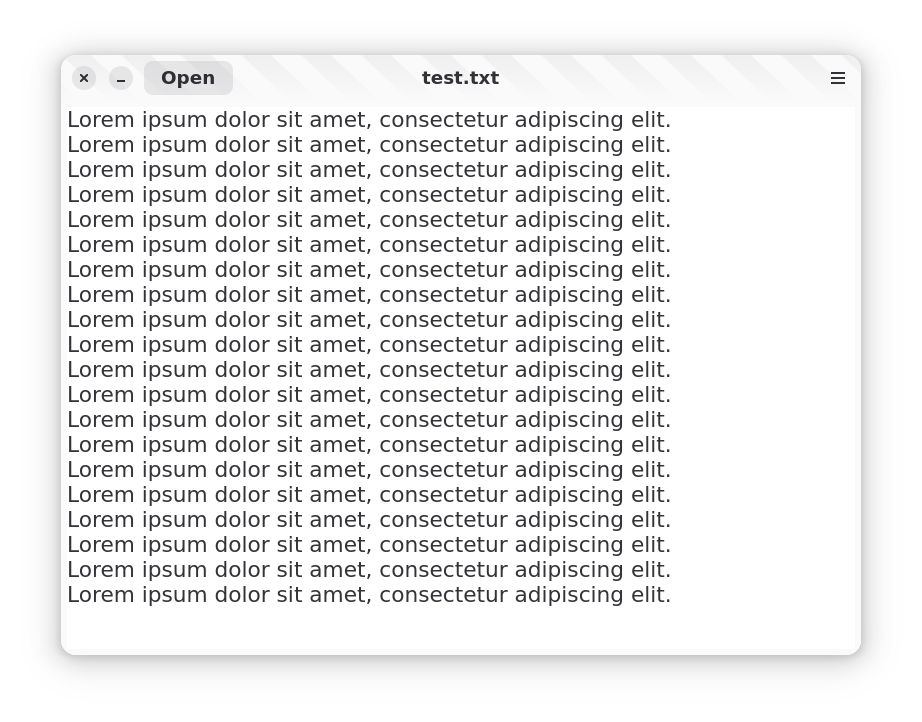

# Text Viewer Tutorials

## Successfully added content view

The window now displays a content area.  
Below is a screenshot showing the result after adding the view:

## Successfully loaded content from a file

Below are screenshots showing the result after creating a lorem text file and loading it to the text viewer:

