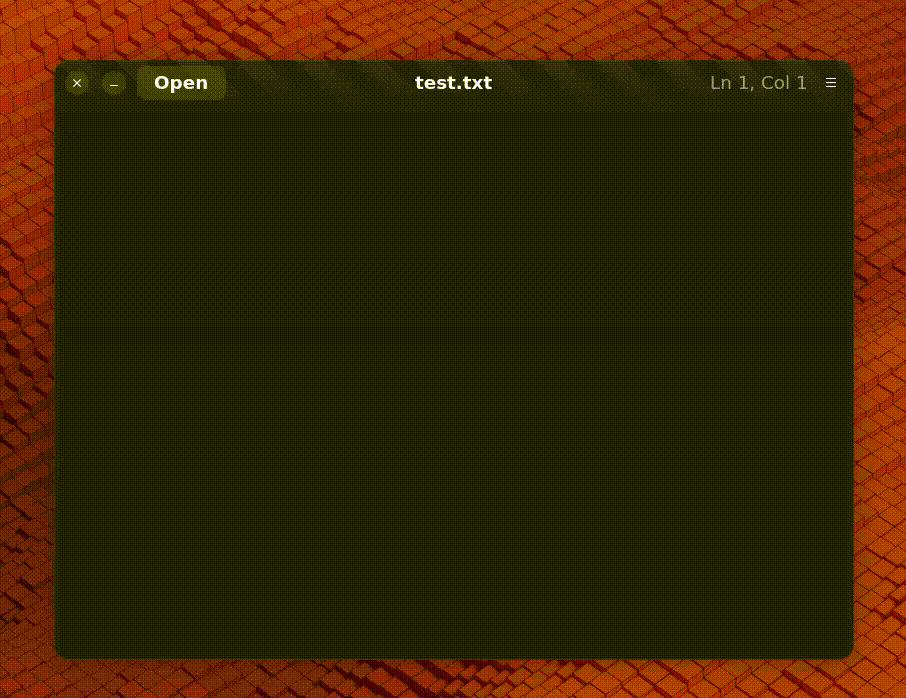
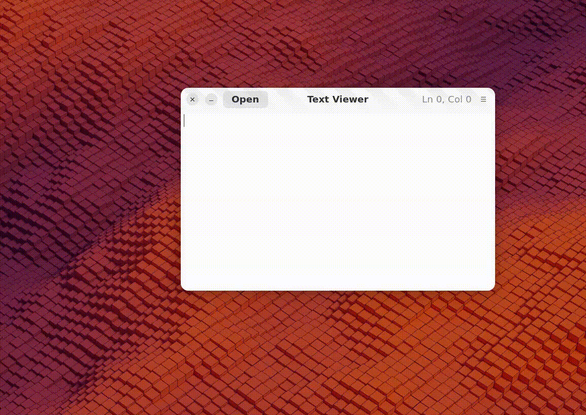

# Text Viewer Tutorials

## Successfully added content view

The window now displays a content area.  
Below is a screenshot showing the result after adding the view:

## Successfully loaded content from a file

Below are screenshots showing the result after creating a lorem text file and loading it to the text viewer:

## Successfully added cursor position functionality

The header now shows the cursor position on the right side.  
Below is a screenshot showing the result after adding this functionality:

## Successfully added save as functionality

Below is a demo GIF showing the result after adding Save As:

## Successfully added functionality to save and restore the size and state of the window across different sessions 

Below is a demo GIF showing the result after adding this functionality:

